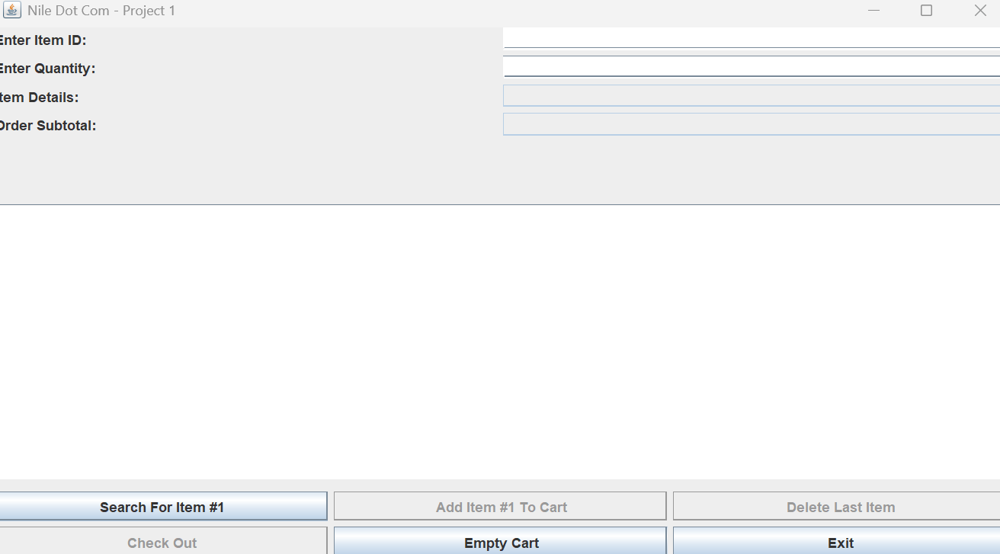
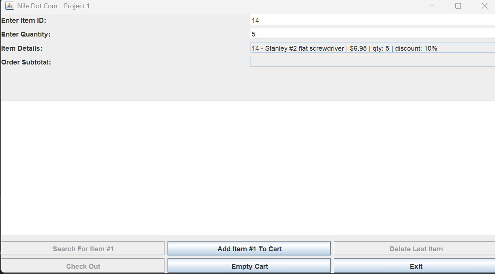
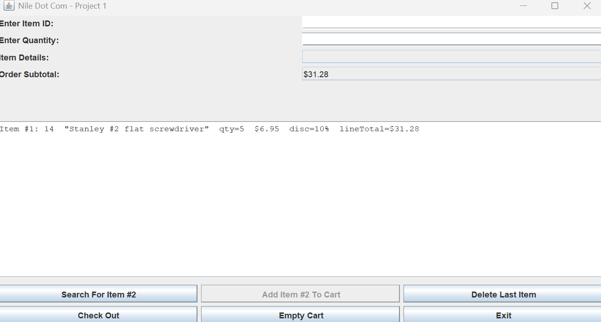
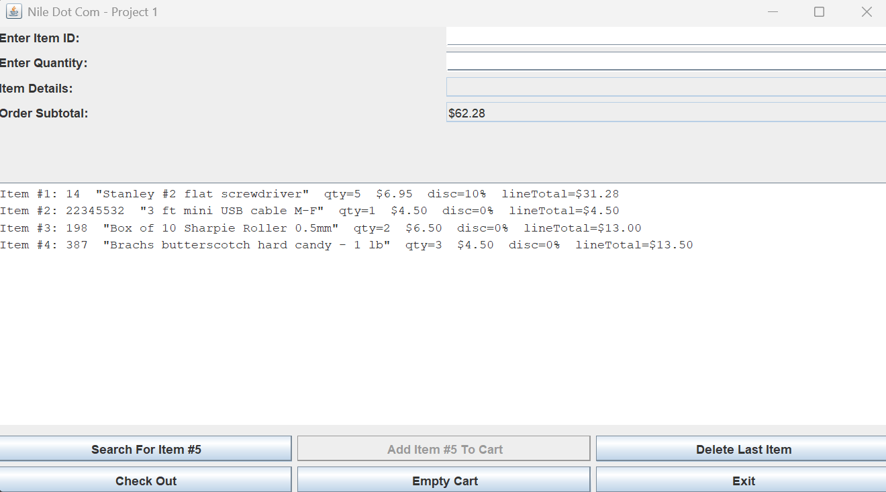
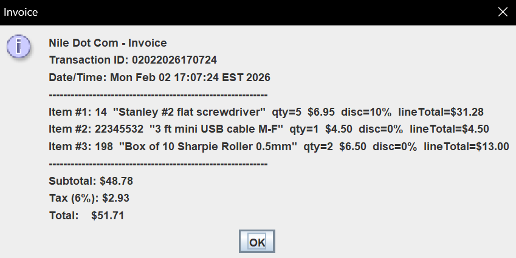
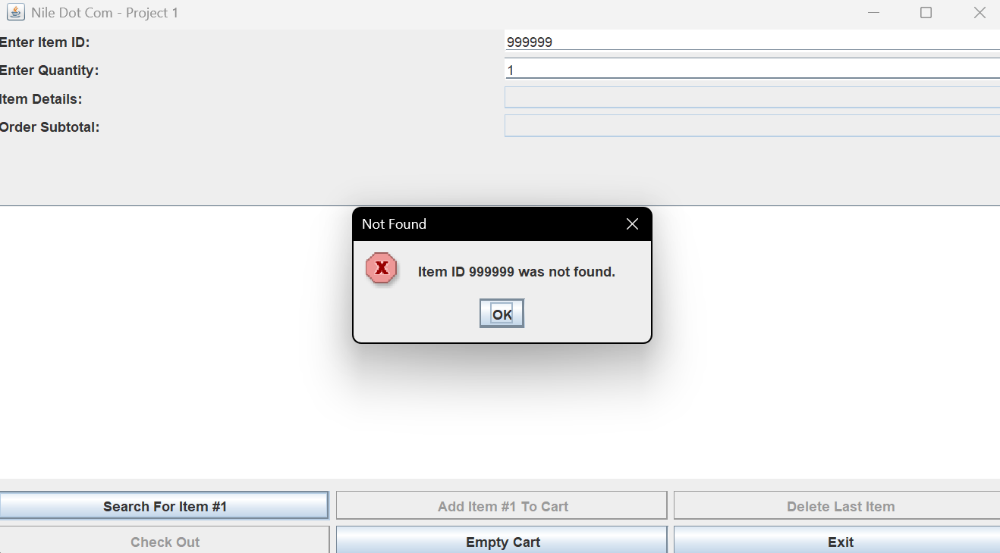
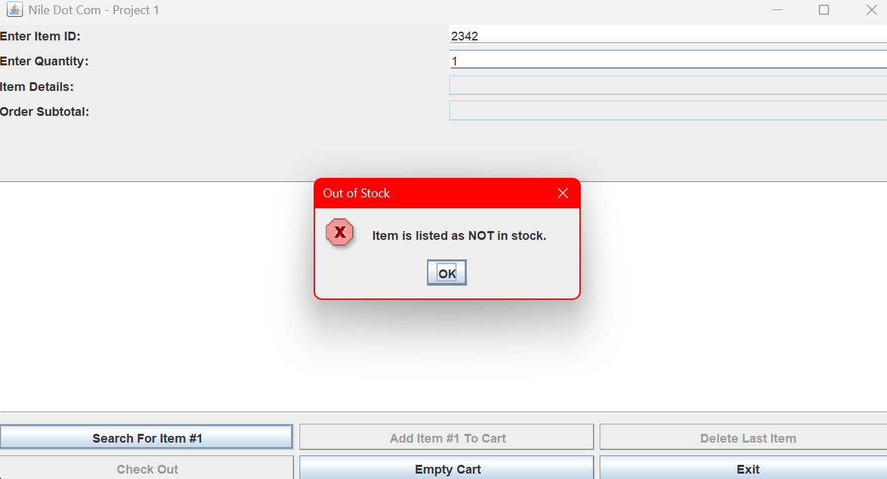

# Java Swing E-Commerce Application

Desktop e-commerce application built with Java Swing. The program allows users to search products, add items to a cart, apply quantity-based discounts, generate an invoice, and log transactions to a CSV file.

## Features
- Search inventory by Item ID
- Add items to a shopping cart (up to 5 items)
- Automatic discount calculation based on quantity
- Real-time subtotal and tax calculation
- Error handling for:
  - Invalid Item ID
  - Out of stock items
  - Invalid quantity input
- Invoice generation at checkout
- Transaction logging to CSV

## Technologies
- Java
- Java Swing
- File I/O (CSV)
- Event-driven programming

## Project Structure
src/ - source code  
data/ - inventory.csv  
screenshots/ - application images  

## Running the Application

Compile:
javac src/NileDotCom.java

Run:
java -cp src NileDotCom

Make sure `inventory.csv` is located in the `data` folder before running.

## Screenshots

Main Interface  

Search  

Add Item  

Cart  

Checkout  

Error Handling  
  

## Author
Lewis Marte
